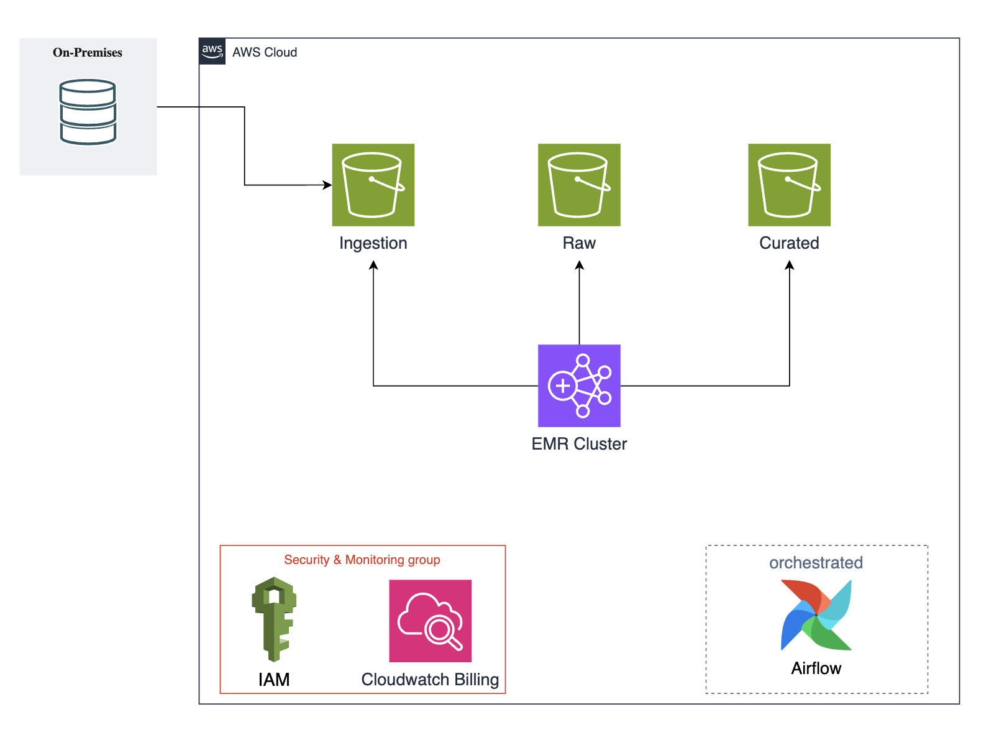
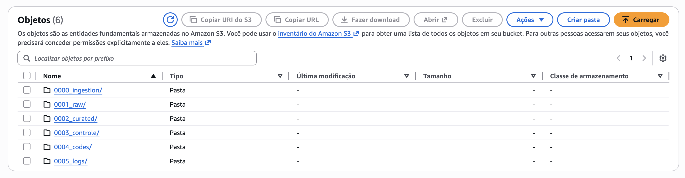
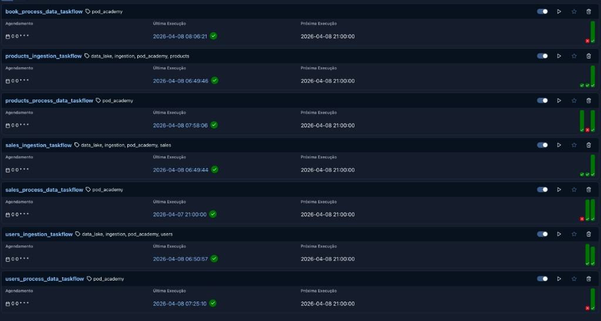

# 🚀 Projeto Data Lake - Pod Academy

Este repositório contém a infraestrutura e os pipelines de dados para um Data Lake corporativo construído na AWS. O projeto utiliza a **Arquitetura Medalhão** para a organização dos dados, processamento distribuído com **Amazon EMR** e é totalmente orquestrado utilizando o **Apache Airflow**.

---

## 🏗️ Arquitetura do Projeto

A arquitetura foi desenhada para ser escalável, segura e de fácil manutenção, extraindo dados de um banco de dados on-premises e processando-os em um ambiente Cloud.

**Componentes Principais:**
* **On-Premises:** Banco de dados de origem de onde as informações são extraídas.
* **AWS S3 (Storage):** Armazenamento principal do Data Lake, dividido em zonas de processamento.
* **Amazon EMR (Processamento):** Cluster utilizado para realizar as transformações de dados entre as camadas do Data Lake de forma distribuída.
* **Apache Airflow (Orquestração):** Responsável por agendar, gerenciar e monitorar os fluxos de extração e processamento.
* **Security & Monitoring:** Controle de acesso gerido via **AWS IAM** e monitoramento de custos operacionais utilizando **CloudWatch Billing**.

---

## 🗂️ Estrutura do Data Lake (Arquitetura Medalhão)

Os dados no Amazon S3 estão organizados de forma lógica em pastas (prefixos) que representam as camadas da arquitetura medalhão, além de pastas operacionais para o funcionamento do pipeline:

* `0000_ingestion/`: Área de pouso (*landing zone*) para os dados brutos recém-extraídos da origem.
* `0001_raw/`: Camada **Bronze**, contendo os dados brutos armazenados em seu formato original com histórico.
* `0002_curated/`: Camadas **Silver/Gold**, onde os dados já estão limpos, transformados, enriquecidos e prontos para consumo por ferramentas de BI ou Cientistas de Dados.
* `0003_controle/`: Arquivos de controle de processos e metadados.
* `0004_codes/`: Armazenamento centralizado dos scripts de processamento (ex: scripts PySpark executados pelo EMR).
* `0005_logs/`: Destino dos logs de execução do cluster EMR e de outros serviços da AWS, facilitando o *troubleshooting*.

---

## ⚙️ Orquestração de Pipelines (Apache Airflow)

Todo o fluxo de dados é orquestrado pelo Apache Airflow. Os pipelines foram divididos por domínios de negócio (`books`, `products`, `sales`, `users`) e segregados entre tarefas de ingestão e tarefas de processamento de dados.

**DAGs Atuais:**
* `books_process_data_taskflow`
* `products_ingestion_taskflow` & `products_process_data_taskflow`
* `sales_ingestion_taskflow` & `sales_process_data_taskflow`
* `users_ingestion_taskflow` & `users_process_data_taskflow`

**Características do Agendamento:**
* As DAGs estão configuradas para rodar diariamente (expressão cron `0 0 * * *`).
* Uso de tags de categorização (`pod_academy`, `data_lake`, `ingestion`, etc.) para fácil navegação e monitoramento na UI do Airflow.

---

## 🛠️ Tecnologias Utilizadas

* **Cloud Provider:** AWS (Amazon Web Services)
* **Data Storage:** Amazon S3
* **Data Processing:** Amazon EMR (Apache Spark)
* **Orchestration:** Apache Airflow
* **Security & Logging:** AWS IAM, AWS CloudWatch
